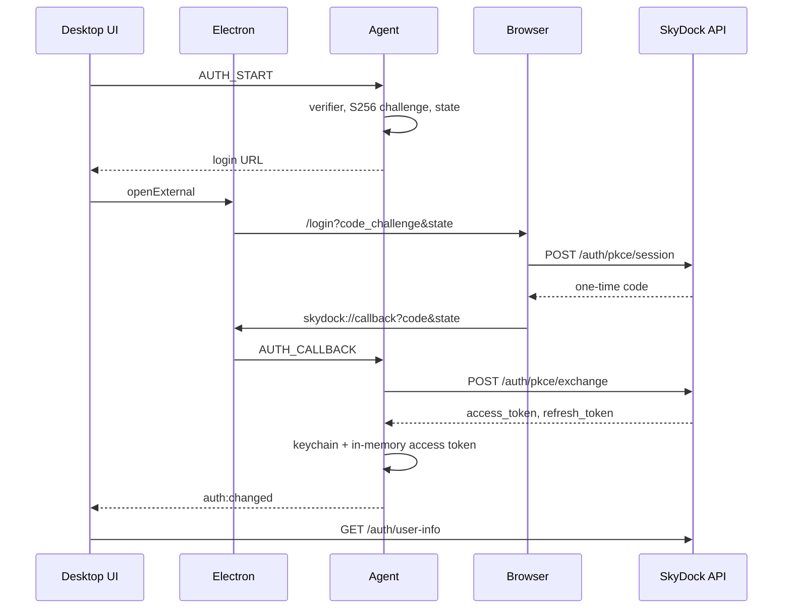

# Desktop PKCE sign-in

The desktop app is a public client. It signs the user in through the SkyDock website, then the Go agent exchanges a one-time authorization code for API tokens using [PKCE](https://datatracker.ietf.org/doc/html/rfc7636) (S256).

The code verifier never leaves the agent. The refresh token is stored in the OS keychain. The access token is kept in agent memory and is also sent to the Electron renderer so the UI can call `/auth/user-info`.

Website login and the HTTP API are documented in the SkyDock repo (`apps/server/docs/pkce.md`, `apps/web/docs/pkce.md`). This page is the agent and desktop side of that flow.

## Overview

1. The user clicks **Login**. The renderer sends `AUTH_START` to the agent over ZeroMQ.
2. The agent generates a code verifier, an S256 code challenge, and a `state` value, and returns a `/login` URL.
3. Electron opens that URL in the system browser (`http` or `https` only).
4. After the user signs in, the website redirects the browser to `skydock://callback?code&state`.
5. Electron (single instance) parses that URL and sends `AUTH_CALLBACK` to the agent.
6. The agent checks `state` and the 2-minute pending-login window, then calls `POST /auth/pkce/exchange`.
7. The agent saves the refresh token in the keychain, sets the bearer token on the API client, and emits `auth:changed`.



## Login URL

Built in `Session.Start` from `SKYDOCK_WEB_URL` (default `http://localhost:5173`):

```
{SKYDOCK_WEB_URL}/login?code_challenge=<S256>&code_challenge_method=S256&redirect_uri=skydock://callback&state=<opaque>
```

| Piece | Where it lives |
|-------|----------------|
| `code_verifier` | Agent memory only, until exchange or expiry |
| `code_challenge` | `BASE64URL(SHA256(verifier))`, no padding. 32 random bytes, encoded |
| `state` | 32 random bytes, encoded. Compared in constant time on callback |
| `redirect_uri` | Fixed `skydock://callback` |

A new `AUTH_START` replaces any pending login. The pending verifier and state expire after 2 minutes. A missing pending login, an expired one, or a `state` mismatch returns `sign-in expired` or `sign-in failed` and clears the pending login.

Exchange does not send `redirect_uri`. Session-issued codes on the server store a null redirect binding.

## ZMQ events

Inbound events are request/ack. `auth:changed` is pushed to every connected desktop peer.

| Event | Direction | Body | Ack / payload |
|-------|-----------|------|----------------|
| `AUTH_START` | UI → agent | empty | `{ ok, url }` or `{ ok: false, error }` |
| `AUTH_CALLBACK` | Electron → agent | `{ code, state }` | `{ ok, authenticated: true }` or `{ ok: false, error }` |
| `AUTH_SESSION` | UI → agent | empty | `{ ok, authenticated, accessToken, apiBaseUrl }` |
| `AUTH_LOGOUT` | UI → agent | empty | `{ ok, authenticated: false }` |
| `auth:changed` | agent → UI | — | `{ authenticated, accessToken, apiBaseUrl }` |

`accessToken` is empty when `authenticated` is false. Handler errors are returned inside the ack (`ok: false`) so the desktop can show them; the ZMQ call itself succeeds.

## Custom scheme

`skydock://callback` is registered as the default protocol client:

- Packaged app: `app.setAsDefaultProtocolClient('skydock')`.
- `electron .` dev (`process.defaultApp`): the executable plus the app path, so the OS launches this checkout.

macOS delivers the URL on `open-url`. Windows and Linux pass it on `argv` (`second-instance` and the initial `process.argv`). The app takes a single-instance lock so a second launch focuses the existing window and forwards the URL.

Electron accepts only `skydock://callback` with both `code` and `state`. The payload is queued until the ZMQ bus is connected, then sent as `AUTH_CALLBACK`. A failed emit stays queued for the next connect.

`shell.openExternal` allows `http:` and `https:` only.

## Tokens

| Artifact | Storage | Lifetime handling |
|----------|---------|-------------------|
| Refresh token | OS keychain, service `SkyDock Agent`, account `refresh-token` | Also kept in agent memory while signed in |
| Access token | Agent memory, API client `Authorization` header, and the renderer | Refreshed when it expires within 60 seconds |
| Authorization code | Not stored after exchange | Server lifetime 2 minutes, single use |

On startup, `Session.Restore` loads the keychain refresh token and calls `POST /auth/pkce/refresh`. If that call fails, the keychain entry is deleted and the user must sign in again.

`RunKeepalive` runs every 30 seconds. When the access token is inside the 60-second skew window, concurrent refreshes share one in-flight `POST /auth/pkce/refresh` (`singleflight`). A failed refresh while signed in clears the keychain and emits `auth:changed` with `authenticated: false`.

`AUTH_LOGOUT` deletes the keychain entry and clears memory. It does not call a server revoke endpoint.

API calls from the agent use `SKYDOCK_API_URL` (default `http://localhost:3000/api/v1`) and `SKYDOCK_API_TIMEOUT` (default `30s`):

- `POST auth/pkce/exchange` with `{ code, code_verifier }`
- `POST auth/pkce/refresh` with `{ refresh_token }`

The renderer loads the profile once per sign-in:

```http
GET {apiBaseUrl}/auth/user-info
Authorization: Bearer <access_token>
```

That response fills the name, email, picture, and storage fields. A later access-token refresh does not refetch the profile.

## Code map

| Piece | Role |
|-------|------|
| [`internal/auth/pkce.go`](../apps/agent-service/internal/auth/pkce.go) | Verifier, S256 challenge, and state |
| [`internal/auth/session.go`](../apps/agent-service/internal/auth/session.go) | Pending login, exchange, refresh, keepalive, logout |
| [`internal/auth/keystore.go`](../apps/agent-service/internal/auth/keystore.go) | OS keychain via `zalando/go-keyring` |
| [`internal/api/pkce.go`](../apps/agent-service/internal/api/pkce.go) | Exchange and refresh HTTP calls |
| [`internal/zmq/auth_handlers.go`](../apps/agent-service/internal/zmq/auth_handlers.go) | `AUTH_*` handlers and `auth:changed` |
| [`electron/skydock-auth.ts`](../apps/desktop/electron/skydock-auth.ts) | `skydock://` registration and callback queue |
| [`electron/main.ts`](../apps/desktop/electron/main.ts) | Single-instance lock and protocol wiring |
| [`src/context/AuthContext.tsx`](../apps/desktop/src/context/AuthContext.tsx) | Session load, login, logout, `auth:changed` |
| [`src/hooks/useGetUserInfo.ts`](../apps/desktop/src/hooks/useGetUserInfo.ts) | `GET /auth/user-info` after sign-in |
